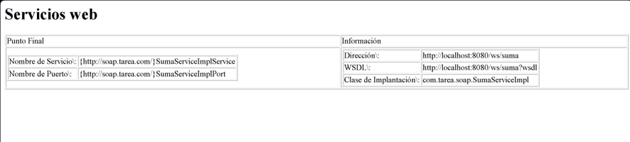
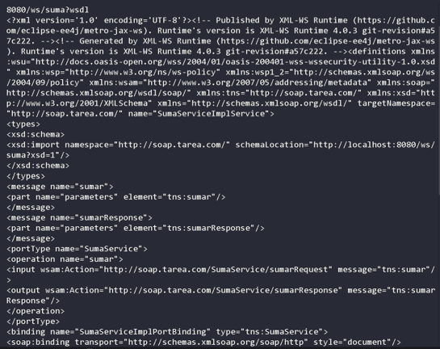
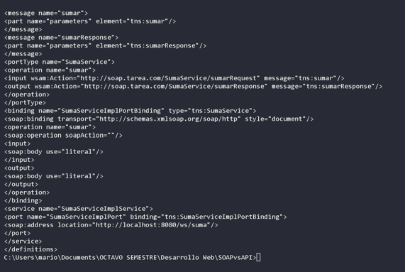
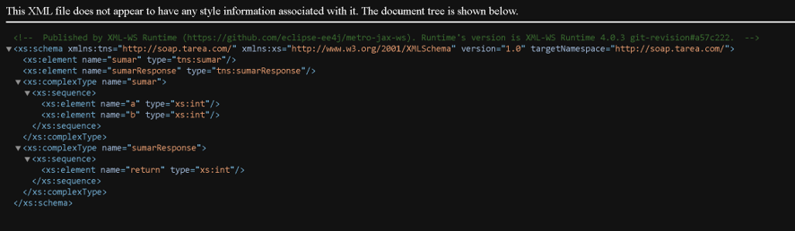
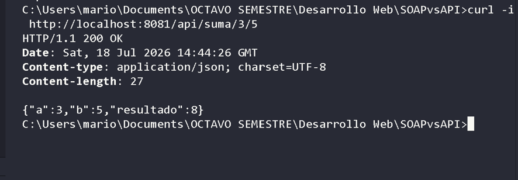
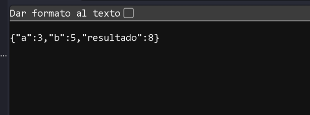
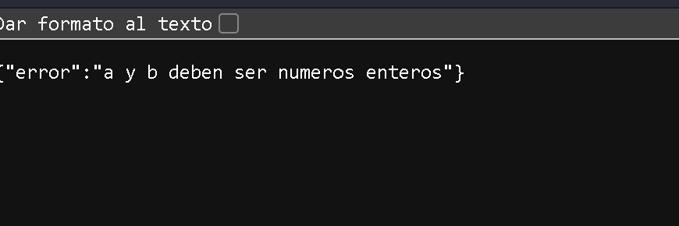

# Comparacion SOAP vs REST

Proyecto Java sencillo que implementa la misma operacion (**sumar dos numeros enteros**) usando dos estilos de servicios distintos: una **API SOAP** con contrato WSDL y una **API REST** con respuestas JSON.

---

## Requisitos del proyecto

- **Operacion elegida:** Suma de dos numeros enteros.
- **Enfoque SOAP:** Code First con JAX-WS (Jakarta XML Web Services).
- **Enfoque REST:** Servidor HTTP embebido con respuestas JSON.

### Version de Java

- **JDK 17** o superior (proyecto desarrollado y probado con JDK 25).

### Build Tool

- **Maven 3.8+** (proyecto multi-modulo con un `pom.xml` padre y dos modulos: `soap` y `rest`).

---

## Instrucciones para ejecutar el proyecto

### 1. Compilar

```bash
mvn clean compile
```

### 2. Levantar el servicio SOAP (puerto 8080)

```bash
mvn -pl soap -am compile exec:java -Dexec.mainClass=com.tarea.soap.ServidorSoap
```

Salida esperada:

```
Servicio SOAP publicado en: http://localhost:8080/ws/suma
WSDL disponible en:        http://localhost:8080/ws/suma?wsdl
```

### 3. Levantar el servicio REST (puerto 8081)

En otra terminal:

```bash
mvn -pl rest -am compile exec:java -Dexec.mainClass=com.tarea.rest.ServidorRest
```

Salida esperada:

```
Servicio REST escuchando en http://localhost:8081/api/suma/{a}/{b}
```

---

## Como consumir el servicio SOAP

### Ver el contrato WSDL

Con el servidor SOAP corriendo, abri en el navegador o ejecuta:

```bash
curl http://localhost:8080/ws/suma?wsdl
```

### Probar con curl

```bash
curl -X POST http://localhost:8080/ws/suma -H "Content-Type: text/xml;charset=UTF-8" -H "SOAPAction: \"\"" -d "<?xml version=\"1.0\" encoding=\"UTF-8\"?><soapenv:Envelope xmlns:soapenv=""http://schemas.xmlsoap.org/soap/envelope/"" xmlns:tns=""http://soap.tarea.com/""><soapenv:Body><tns:sumar><a>3</a><b>5</b></tns:sumar></soapenv:Body></soapenv:Envelope>"
```

Respuesta esperada:

```xml
<?xml version='1.0' encoding='UTF-8'?><S:Envelope xmlns:S="http://schemas.xmlsoap.org/soap/envelope/"><S:Body><ns2:sumarResponse xmlns:ns2="http://soap.tarea.com/"><return>8</return></ns2:sumarResponse></S:Body></S:Envelope>
```

### Probar con SoapUI

1. `File > New SOAP Project`.
2. En **Initial WSDL** pegar: `http://localhost:8080/ws/suma?wsdl`.
3. Expandir `SumaServiceImplService > SumaServiceImplPort > sumar`.
4. Completar los valores de `a` y `b` y presionar Run.

---

## Como consumir el servicio REST

### Probar con curl

```bash
curl -i http://localhost:8081/api/suma/3/5
```

Respuesta esperada:

```
HTTP/1.1 200 OK
Content-Type: application/json; charset=UTF-8

{"a":3,"b":5,"resultado":8}
```

### Caso de error

```bash
curl -i http://localhost:8081/api/suma/foo/5
```

Respuesta esperada:

```
HTTP/1.1 400 Bad Request
Content-Type: application/json; charset=UTF-8

{"error":"a y b deben ser numeros enteros"}
```

### Probar con Postman

1. Nueva request `GET`.
2. URL: `http://localhost:8081/api/suma/10/20`.
3. Send y ver el JSON de respuesta con codigo HTTP 200.

---

## Capturas de las pruebas

### WSDL del servicio SOAP



### Prueba SOAP con curl (suma 3 + 5)



### Prueba REST con curl (suma 3 + 5, 200 OK)



### Prueba REST con curl (error 400 Bad Request)



### Servidor SOAP ejecutandose



### Servidor REST ejecutandose



### WSDL abierto en el navegador



---

## Comparacion entre SOAP y REST

Al desarrollar ambos servicios para implementar la misma operacion sumar dos numeros, encontramos diferencias significativas. SOAP requiere mas ceremonia es necesario crear una interfaz Java anotada  y el framework genera automaticamente un contrato WSDL con las secciones type y portType , binding y service . La respuesta viaja envuelta en un sobre XML mas pesado.

REST es mas sencillo de implementar y de probar con solo el JDK  se pudo crear un servidor HTTP que recibe una URL y devuelve un JSON simple. No hay contrato formal no hay WSDL, y el formato JSON es mas liviano y legible que el XML.

Utilizariamos SOAP en escenarios donde se necesita un contrato estricto y verificable entre el cliente y el servidor, como integraciones empresariales, sistemas bancarios o gubernamentales, o cuando se requiere seguridad avanzada a nivel de mensaje (WS-Security) y transacciones confiables.

Utilizariamos REST para la mayoria de las APIs web modernas aplicaciones moviles y microservicios  por su simplicidad, bajo overhead, velocidad de desarrollo y facilidad de integracion con cualquier lenguaje o plataforma.

---

## Estructura del proyecto

comparacion-soap-rest/
|
|-- README.md
|-- .gitignore
|-- pom.xml                    # POM padre (multi-modulo)
|-- soap/                      # Modulo del servicio SOAP
|   |-- pom.xml
|   +-- src/main/java/com/tarea/soap/
|       |-- SumaService.java         # Interfaz SEI (Service Endpoint Interface)
|       |-- SumaServiceImpl.java     # Implementacion de la operacion sumar()
|       +-- ServidorSoap.java        # main() que publica el endpoint SOAP
|-- rest/                      # Modulo del servicio REST
|   |-- pom.xml
|   +-- src/main/java/com/tarea/rest/
|       +-- ServidorRest.java        # main() que levanta el servidor HTTP REST
+-- wsdl/
    +-- servicio.wsdl           # Contrato WSDL de referencia
```
